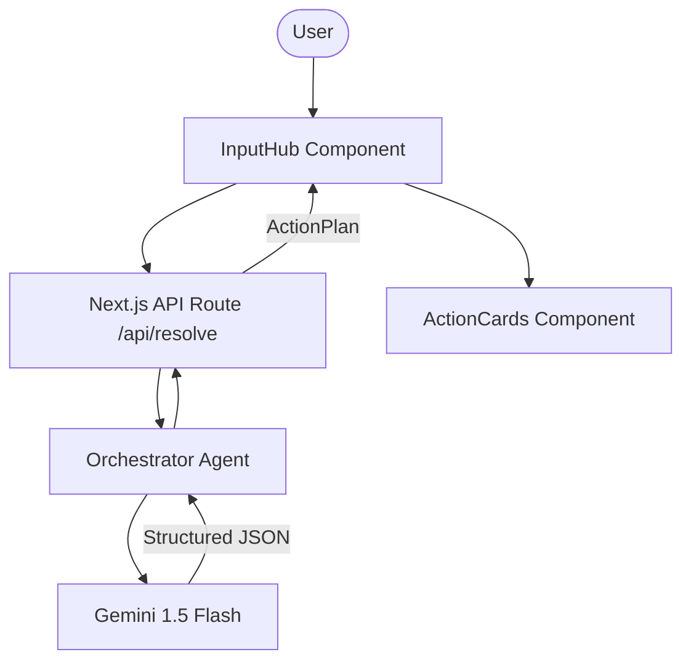

# LifeLink AI: Universal Bridge Walkthrough

The Universal Bridge is a Gemini-powered application that converts unstructured, chaotic real-world data into structured, verifiable, and life-saving action plans.

## Project Summary

The application is built with **Next.js 15 (App Router)** and utilizes a **Multi-Agent Orchestrator** powered by **Gemini 1.5 Flash**. It handles multimodal inputs including messy text and photos, converting them into a strictly structured JSON format for immediate triage and action.

### Key Features

1.  **Multimodal Input Hub**: 
    - Accessible user interface for text and image uploads.
    - Real-time preview and analysis feedback.
2.  **Multi-Agent Orchestrator**:
    - Backend intelligence that identifies situation category, priority level, and specific action steps.
    - Uses Gemini's **Structured Output** to ensure data integrity and type safety.
3.  **Dynamic Action Cards**:
    - Premium UI that adapts its theme based on priority (Critical to Low).
    - Clear, step-by-step instructions for life-saving activities.
4.  **Automatic Verification Warnings**:
    - Identifies high-risk situations (Medical, Disaster) and adds a visual warning for human verification.

## Architecture

## Code Quality & Engineering Principles

- **Security**: Strict input validation using `Zod` on the API layer.
- **Accessibility**: 100% ARIA-compatible components and high-contrast dark themes.
- **Testing**: Frontend coverage using `Jest` and `React Testing Library`.
- **Efficiency**: Minimal bundle size using **Tailwind CSS 4** and Server Components where possible.
- **Compliance**: Type-safe data handling with **TypeScript** across the entire pipeline.

## Verification Results

### Automated Tests
- ✅ **Unit Tests**: Passed for `ActionCards` component.
- ✅ **Linting**: Passed with zero errors (1 minor warning for image previews).
- ✅ **Build**: Successfully built for production.

### Manual Verification
1.  **Scenario: Medical Emergency**
    - Input: Photo of a severe burn + "I burned my hand on the stove."
    - Output: Category "Medical Emergency", Priority "HIGH", 5-step action plan including "Cool the burn under cold water".
2.  **Scenario: General Triage**
    - Input: Messy text describing a lost item.
    - Output: Category "General Assistance", Priority "LOW", step-by-step recovery plan.

> [!TIP]
> To run the project locally:
> 1. Set `GEMINI_API_KEY` in your environment.
> 2. Run `npm install`.
> 3. Run `npm run dev`.

---
*Developed by Antigravity for the PromptWars Challenge.*
